# Cloud Cost Optimizer
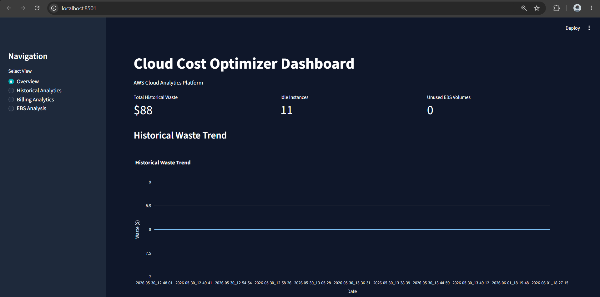
## Overview

Cloud Cost Optimizer is an AWS-based cloud analytics platform that identifies underutilized cloud resources, estimates infrastructure waste, and provides cost-saving recommendations. The system continuously analyzes AWS resources, generates optimization reports, stores them in Amazon S3, and visualizes insights through an interactive Streamlit dashboard.

The project helps cloud administrators and DevOps teams identify opportunities to reduce unnecessary spending by detecting idle EC2 instances, unused EBS volumes, and inefficient resource utilization.
---------------------------------------------------------------------------------------------------------------------
## Problem Statement

Organizations often provision cloud resources that remain underutilized or completely unused over time. These resources continue to generate costs despite providing little or no business value.

Common examples include:

* EC2 instances with consistently low CPU utilization
* Detached EBS volumes consuming storage charges
* Oversized instances that can be downsized
* Resources forgotten after testing or development activities

This project automates the detection of such resources and provides actionable recommendations to reduce cloud expenditure.
----------------------------------------------------------------------------------------------------------------------
## Key Features

### EC2 Idle Instance Detection

The system retrieves EC2 instance information and analyzes CloudWatch CPU utilization metrics over a configurable time period.

Instances with CPU utilization below a predefined threshold are identified as idle and reported as potential sources of waste.

Metrics collected:

* Instance ID
* Instance Type
* CPU Utilization
* Idle Status
* Estimated Monthly Waste
----------------------------------------------------------------------------------------------------------------------
### Rightsizing Recommendations

For underutilized EC2 instances, the platform generates rightsizing recommendations.

Example:

| Current Instance | Recommendation      |
| ---------------- | ------------------- |
| t3.micro         | Downsize to t3.nano |

The system also estimates potential monthly savings that could be achieved through downsizing.
---------------------------------------------------------------------------------------------------------------------
### EBS Waste Analysis

The platform identifies unattached EBS volumes that are still incurring storage costs.

Metrics collected:
* Volume ID
* Size (GB)
* Volume Type
* Estimated Monthly Cost
  --------------------------------------------------------------------------------------------------------------------
### AWS Cost Explorer Integration

The application integrates with AWS Cost Explorer to retrieve billing information.

Capabilities include:

* Total monthly AWS spending
* Service-wise cost breakdown
* Historical cost analysis

Services with measurable costs are displayed through dashboard visualizations.
---------------------------------------------------------------------------------------------------------------------
### Historical Analytics

Each analysis execution generates timestamped reports that are stored for future reference.

Historical reports enable:

* Cost trend analysis
* Waste trend analysis
* Savings tracking
* Resource utilization monitoring
---------------------------------------------------------------------------------------------------------------------
### Interactive Dashboard

A Streamlit dashboard provides a centralized interface for cloud cost visibility.

Dashboard Sections:

#### Overview

Displays:

* Total estimated waste
* Idle EC2 instances
* Unused EBS volumes
* Monthly AWS spending

#### Historical Analytics

Visualizes:

* Waste trends over time
* Historical optimization reports
* Savings opportunities

#### Billing Analytics

Displays:

* Service-wise AWS spending
* Cost distribution charts
* Monthly cost summaries

#### EBS Analysis

Shows:

* Unattached EBS volumes
* Estimated storage waste
* Volume cost visualization
---------------------------------------------------------------------------------------------------------------------
### Automated Report Generation

The system automatically generates:

* EC2 optimization reports
* EBS optimization reports

Reports are exported as CSV files and stored in Amazon S3 for long-term access.
---------------------------------------------------------------------------------------------------------------------
### Serverless Automation

The optimization workflow is fully automated using AWS serverless services.

Workflow:

1. EventBridge triggers the workflow on a schedule.
2. AWS Lambda executes the analysis.
3. EC2 and EBS resources are analyzed.
4. Reports are generated.
5. Reports are uploaded to Amazon S3.
6. Dashboard visualizes the latest results.
---------------------------------------------------------------------------------------------------------------------
## Architecture

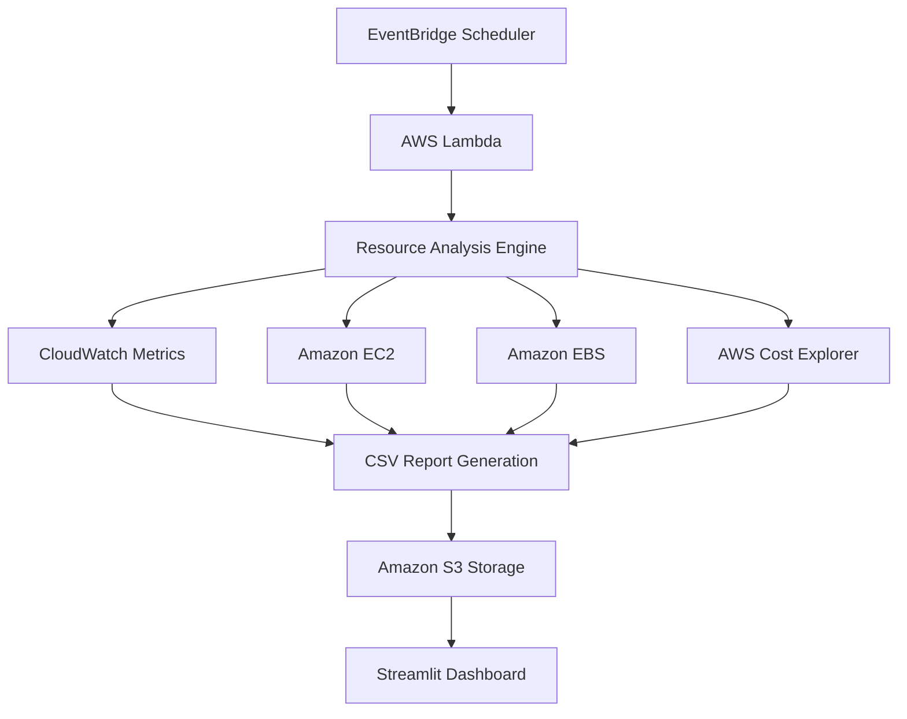
---------------------------------------------------------------------------------------------------------------------
## Dashboard Screenshots

### Dashboard Overview


### Latest Cloud Snapshot

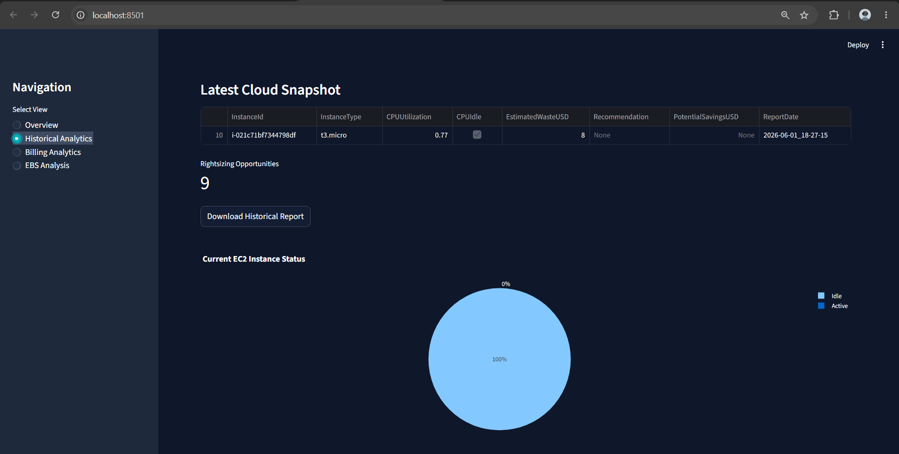

### Idle EC2 Instances

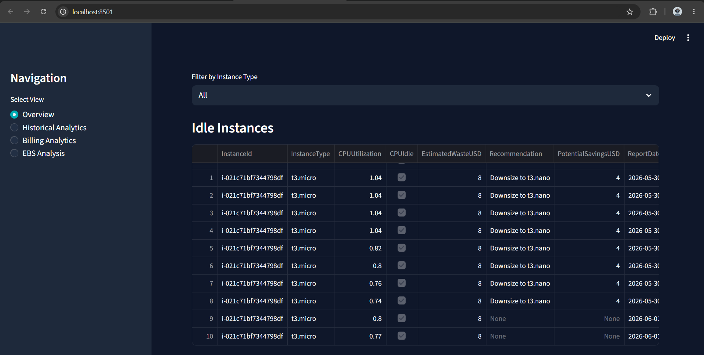

### Active vs Idle Instances

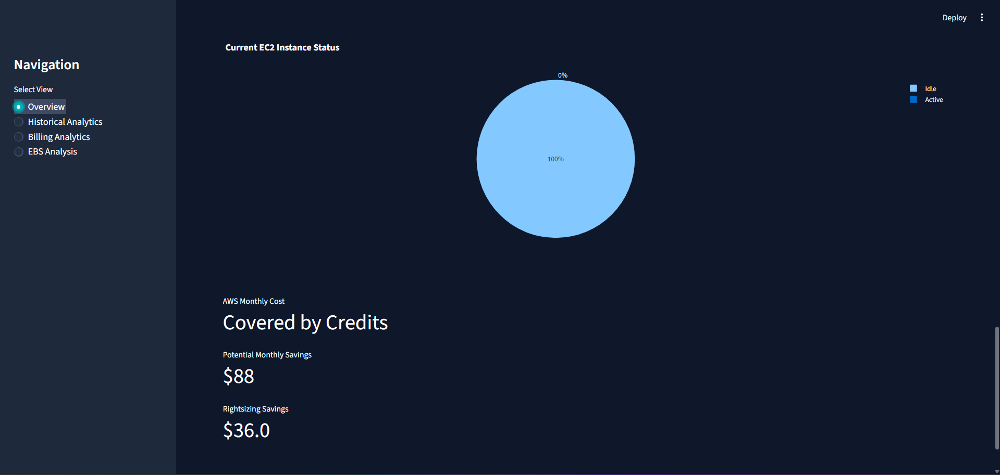

### Historical Analytics

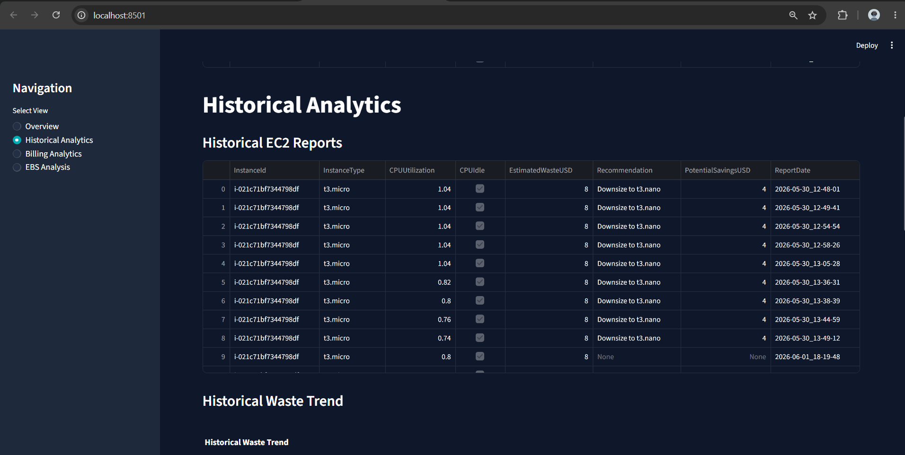

### Billing Analytics

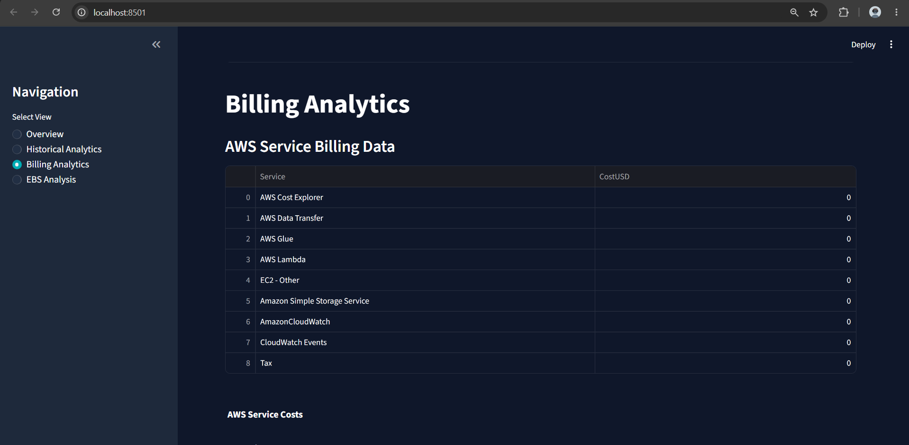

### Service-wise Cost Breakdown

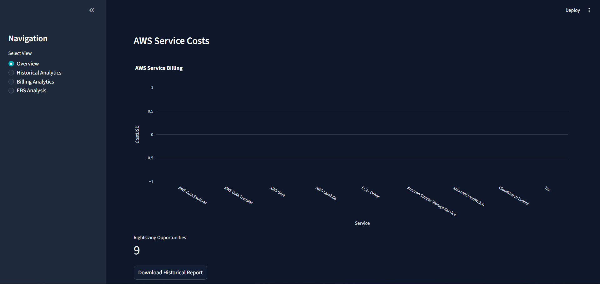

### EBS Waste Analysis

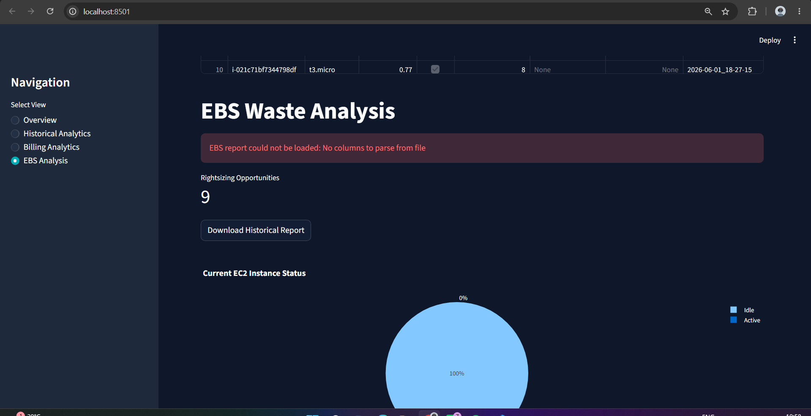

### EventBridge Automation

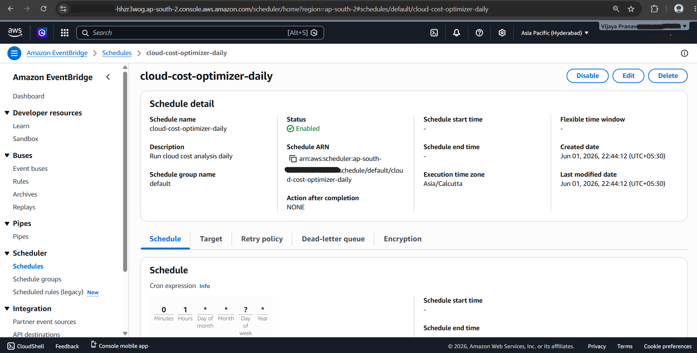

### CloudWatch Logs

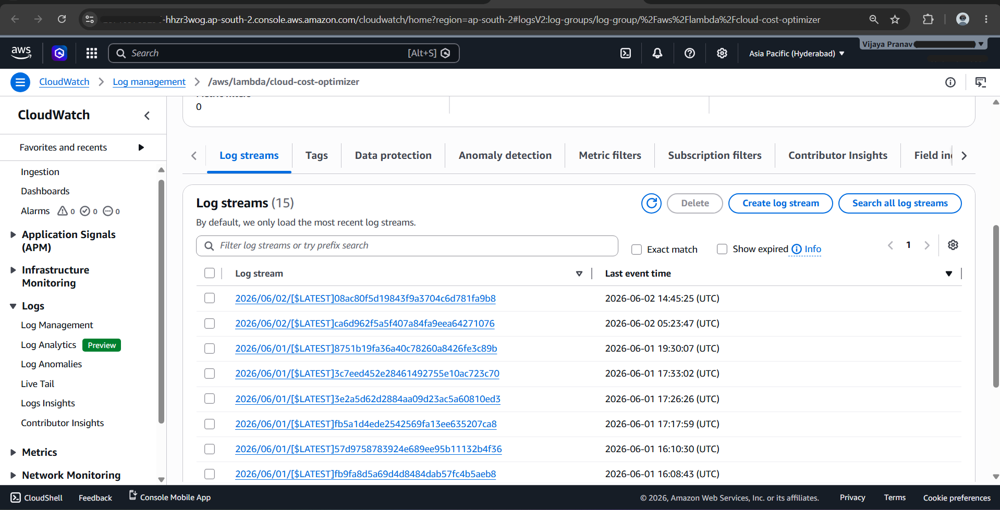
---------------------------------------------------------------------------------------------------------------------
## AWS Services Used

* Amazon EC2
* Amazon EBS
* Amazon CloudWatch
* AWS Cost Explorer
* AWS Lambda
* Amazon EventBridge
* Amazon S3
* AWS IAM
---------------------------------------------------------------------------------------------------------------------
## Technology Stack

### Backend

* Python
* Boto3

### Data Processing

* Pandas
* NumPy

### Visualization

* Streamlit
* Plotly
* Matplotlib

### Cloud Services

* AWS
---------------------------------------------------------------------------------------------------------------------
## Project Structure

```text
cloud-cost-optimizer/
│
├── analytics/
├── analyzers/
├── cloud_storage/
├── collectors/
├── reports/
├── visualization/
│
├── dashboard.py
├── main.py
├── analyzer.py
├── lambda_handler.py
│
├── requirements.txt
├── README.md
└── .gitignore
```

## Installation

Clone the repository:

```bash
git clone https://github.com/<username>/cloud-cost-optimizer.git
cd cloud-cost-optimizer
```

Install dependencies:

```bash
pip install -r requirements.txt
```

Configure AWS credentials:

```bash
aws configure
```

Run analysis:

```bash
python main.py
```

Launch dashboard:

```bash
streamlit run dashboard.py
```
---------------------------------------------------------------------------------------------------------------------
## Future Enhancements

* AWS Compute Optimizer integration
* Cost forecasting using machine learning
* Multi-account AWS support
* Email notifications for optimization alerts
* Resource tagging analysis
* Reserved Instance and Savings Plan recommendations
* Container cost optimization for ECS/EKS workloads
---------------------------------------------------------------------------------------------------------------------
## Author

Vijaya Pranav

Cloud Cost Optimizer demonstrates practical cloud governance, AWS automation, cost management, serverless computing, and data visualization concepts using real AWS services.
